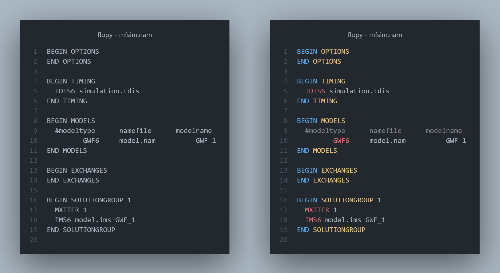

# VS Code MODFLOW 6 Syntax

This extension provides syntax highlighting support for MODFLOW 6 input files in VS Code. This is based on TextMate grammar that is derived from MF6 definition files. The primary goal of this project is to make MF6 input files a bit easier on the eyes.

## Features

- Basic syntax highlighting based on MF6 definition files. For example:
  
- Code folding based on MF6 block structure
- Code snippets based on MF6 block structure
- Others: comment-toggling, auto-closing quotes, surrounding quotes

## Usage

- The extension activates based on the file's extension. If not detected, use `Change Language Mode` in VS Code and set it to `MODFLOW 6`.
- VS Code's minimap can display enlarged section headers (block names), which may appear cluttered. To simplify the view, disable this feature by setting `editor.minimap.showRegionSectionHeaders` to `false`.

## Release Notes

### 0.0.2

- Automate generation of package.json and all.tmLanugage.yaml from jinja template
- Add icon
- Add READARRAY keywords

### 0.0.1

- Alpha release
