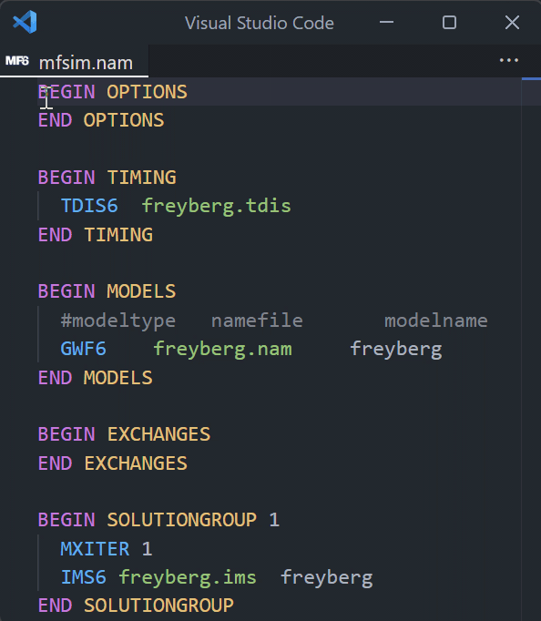

# VS Code MODFLOW 6 Syntax

> [!NOTE]
> This project is currently in beta. Features and functionality may change, and there may be bugs. Feedback and contributions to help improve the project are welcome.

This VS Code extension provides rich language features for [MODFLOW 6](https://modflow6.readthedocs.io/en/stable/index.html). It enhances the readability and editing experience for MF6 files by leveraging specifications directly from MF6 [DFN](https://modflow6.readthedocs.io/en/stable/_dev/dfn.html) files.

## Features

- Syntax highlighting
- Go-to-definition for linked files:
  - `Ctrl + click`
  - `Go To Definition` keybinding (default: `F12`)

- Hover for keyword description
- Hover for block structure

- Others:
  - Block folding
  - Snippet (MF6 block)
  - Comment-toggling
  - Auto-closing quotes
  - Surrounding quotes

## Commands

- `MF6 Syntax: Set language to MF6`
  - useful if extension is not activated automatically (based on file extension)
- `MF6 Syntax: Go to parent file`
  - opens the parent file of the current MF6 file, if it exists
  - for example:
    - if `freyberg.dis` file is active, it opens `freyberg.nam`
    - if `freyberg.nam` file is active, it opens `mfsim.nam`
    - if `mfsim.nam` file is active, no-op since it is the top-level file

## Settings

- `mf6Syntax.maxFileSizeMB`: Maximum file size (in MB) that can be opened through the go-to-definition feature or go-to-parent command (default: `50MB`).
